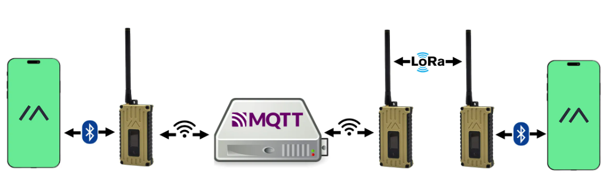
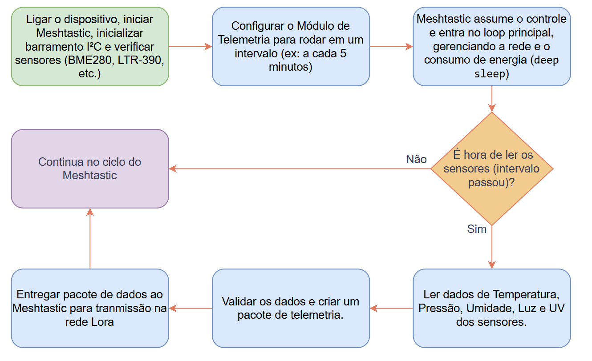
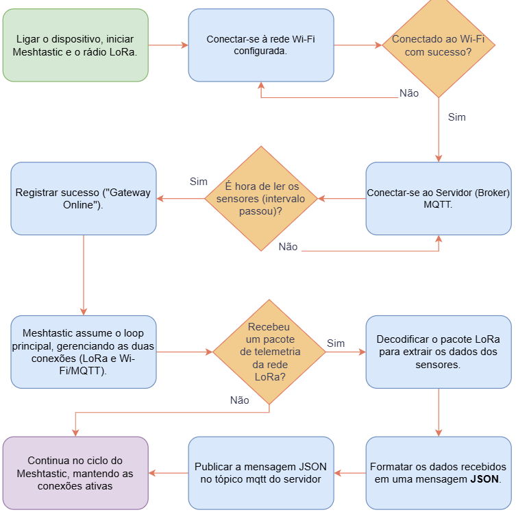
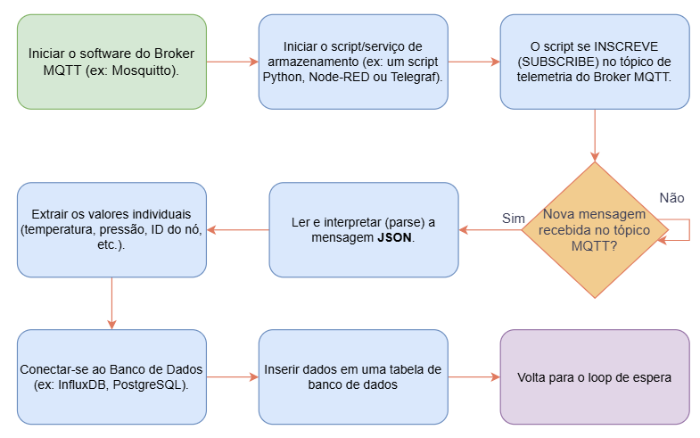

# 📊 Gráficos e Fluxogramas do Projeto AURA

Este documento descreve visualmente o funcionamento físico e lógico do sistema AURA, por meio de imagens explicativas e fluxogramas de software. O sistema é modular e robusto, composto por Nós Sensores, um Nó Gateway MQTT e um Servidor Backend, conectados por uma rede de comunicação LoRa Mesh baseada em Meshtastic.

---

## 🖼️ Imagem 1: Arquitetura Física do Nó Sensor

Esta imagem detalha a montagem física de um único **Nó Sensor**, a unidade instalada no campo para coletar dados meteorológicos. Ela representa a montagem prática do hardware do projeto.

### Componentes:

- **🧠 O Cérebro da Operação:**  
  A placa **Heltec WiFi LoRa 32 V3** está no centro do sistema. Esse microcontrolador executa o firmware **Meshtastic**, lê os sensores conectados e comanda a transmissão dos dados via rádio LoRa.

- **🖐️ Os Sentidos do Nó:**  
  Em torno da Heltec, temos sensores que permitem ao nó "sentir" o ambiente:
  
  - **GY-BME280 (roxo):** Mede **temperatura**, **umidade do ar** e **pressão barométrica**. Sensor fundamental para previsão de chuva.
  - **TSL2591 (azul, abaixo):** Mede a **intensidade da luz ambiente** (em Lux), útil para análises de radiação solar.
  - **UV Sensor (azul, à esquerda):** Mede a **radiação ultravioleta**.
  - **AHT10 (azul, à direita):** Sensor alternativo/redundante de **temperatura** e **umidade**.

- **🔌 Comunicação Interna (I²C):**  
  A fiação colorida demonstra o uso do barramento **I²C**. Essa escolha permite conectar múltiplos sensores ao microcontrolador com apenas **duas linhas de dados** (SDA e SCL), simplificando o circuito e economizando pinos.

➡️ Esta imagem é, essencialmente, o plano de montagem de cada estação meteorológica AURA.

---

## 🖼️ Imagem 2: Arquitetura de Comunicação e Dados

Esta imagem ilustra a **arquitetura lógica** do sistema AURA — como os dados se deslocam do campo até o servidor.

### Elementos principais:

- **🌐 A Ponte entre Mundos (Nó Gateway):**  
  O nó gateway tem um pé no mundo do campo (via **LoRa**) e outro na internet (via **Wi-Fi**). Ele capta os dados da malha LoRa e os envia para a nuvem por meio do protocolo **MQTT**.

- **📬 O Coração do Sistema (Broker MQTT):**  
  O **Broker MQTT** é o servidor central que recebe os dados publicados pelo gateway e os repassa para os serviços de backend.

- **📡 O Fluxo de Dados:**  
  Um nó de campo transmite dados → a rede mesh os propaga → o gateway os escuta → publica no MQTT → o servidor processa e armazena.

- **📱 Interface com o Usuário:**  
  O Meshtastic permite conexão via **Bluetooth**, permitindo que um usuário configure um nó ou visualize dados localmente usando um app.

---

## 🔁 Imagem 3: Etapa 1 – Coleta de Dados no Nó Sensor

Esta imagem representa a **primeira etapa** do sistema AURA: a coleta de dados feita pelos Nós Sensores.

### Funcionamento:

- **Inicialização:**
  - Ao ser ligado, o nó ativa a placa Heltec e o firmware Meshtastic.
  - Estabelece comunicação com os sensores via **I²C**.
  - Verifica se os sensores estão funcionando e registra falhas.

- **Operação Periódica (Agendada):**
  - O nó **não** executa um loop contínuo para economizar energia.
  - A cada intervalo configurado (ex: 5–10 min), o sistema **acorda**, realiza a leitura e transmite os dados.

- **Leitura e Transmissão:**
  - Coleta os dados dos sensores.
  - Valida as medições.
  - Empacota os valores em um **pacote de telemetria Meshtastic**.
  - Envia o pacote via rádio **LoRa**.
  - Volta ao **modo deep sleep** até a próxima ativação.

💡 O Nó Sensor **não se conecta à internet** — sua função é exclusivamente local.

---

## 🌐 Imagem 4: Etapa 2 – Ponte para a Internet no Nó Gateway MQTT

Esta imagem representa a **segunda etapa**: a função do **Nó Gateway MQTT**, responsável por conectar a rede LoRa à internet.

### Funcionamento:

- **Conexão Dupla:**
  - Se conecta à rede **LoRa Mesh** (campo) e à **Wi-Fi** (internet).

- **Escuta Permanente:**
  - Fica escutando continuamente os pacotes de dados enviados por qualquer nó da rede.

- **Encaminhamento:**
  - Quando recebe um pacote, o gateway:
    - Decodifica os dados.
    - Converte para o formato **JSON**.
    - Publica no **tópico MQTT** configurado no broker.

🔁 Esse nó é o **tradutor** entre o campo e a nuvem.

---

## 🧠 Imagem 5: Etapa 3 – Recepção e Armazenamento no Servidor Backend

Esta imagem representa a **terceira etapa**: o papel do servidor backend, responsável por armazenar e disponibilizar os dados.

### Funcionamento:

- **Assinatura MQTT:**
  - O servidor **assina** o mesmo tópico MQTT que o gateway publica.
  - Recebe todos os dados assim que são enviados.

- **Processamento e Armazenamento:**
  - Lê os dados recebidos em JSON.
  - Extrai os campos (ex: `temperatura: 28.5`, `pressão: 1012.3`, etc).
  - Insere os dados em um banco de dados de séries temporais (ex: **InfluxDB**), com timestamp.

- **Utilização:**
  - Os dados armazenados podem ser usados por dashboards (ex: **Grafana**), modelos de previsão climática ou alertas automáticos.

📦 Uma vez no servidor, os dados estão **seguros e acessíveis** para qualquer aplicação.

---

> Este conjunto de gráficos e fluxogramas explica com clareza a estrutura descentralizada, eficiente e escalável do Projeto AURA — da coleta local à análise global.

