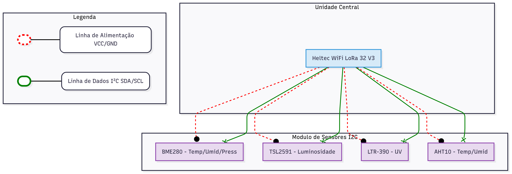
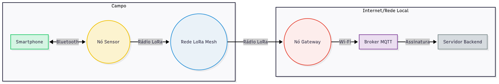
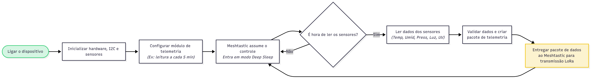
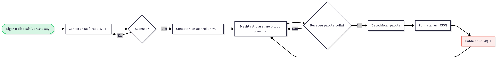
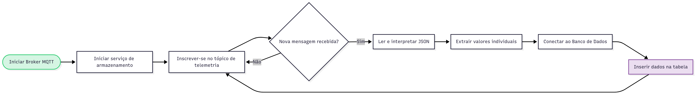

# 📊 Diagramas e Fluxogramas do Projeto AURA

Este documento descreve visualmente o funcionamento físico e lógico do sistema AURA. As seções a seguir detalham a arquitetura de hardware, o fluxo de dados entre os componentes e a lógica de software que governa cada parte do sistema.

### 🖼️ Diagrama de Hardware

O diagrama a seguir detalha a montagem física e as conexões elétricas de um Nó Sensor, a unidade de campo responsável pela coleta de dados. A arquitetura foi organizada em módulos para facilitar a compreensão.

## Descrição dos Módulos e Componentes
### A. Unidade Central de Processamento e Comunicação

- **🧠 O Cérebro da Operação:**  
  A placa **Heltec WiFi LoRa 32 V3** está no centro do sistema. Esse microcontrolador executa o firmware **Meshtastic**, lê os sensores conectados e comanda a transmissão dos dados via rádio LoRa.

### B. Módulo de Sensores Ambientais 🖐️

Função: Coletar as variáveis meteorológicas do ambiente. Todos os sensores comunicam-se com a unidade central através do mesmo barramento I2C, otimizando as conexões.

Componentes:

* GY-BME280: Mede temperatura, umidade relativa do ar e pressão barométrica.

* TSL2591: Mede a intensidade da luz visível e infravermelha (luminosidade).

* LTR-390: Mede a intensidade da radiação ultravioleta (UV).

* AHT10: Sensor secundário para medição de temperatura e umidade.

Detalhamento das Conexões

As linhas no diagrama distinguem claramente os tipos de sinais trocados entre os componentes:

* Linhas de Alimentação (Tracejada/Vermelha): Conexões VCC (3.3V) e GND que fornecem energia da placa Heltec para todos os sensores.

* Linhas de Dados e Controle (Sólida/Verde): Conexões do barramento I2C, composto pelos pinos SDA (Serial Data) e SCL (Serial Clock), que sincronizam e transferem os dados dos sensores para o microcontrolador.

## 🖼️ Blocos Funcionais: Arquitetura de Comunicação e Dados

Este diagrama ilustra a arquitetura lógica do sistema AURA, detalhando o fluxo de informações entre os diferentes módulos, desde a coleta de dados no campo até sua disponibilização para análise.

- **🌐 A Ponte entre Mundos (Nó Gateway):**  
  O nó gateway tem um pé no mundo do campo (via **LoRa**) e outro na internet (via **Wi-Fi**). Ele capta os dados da malha LoRa e os envia para a nuvem por meio do protocolo **MQTT**.

- **📬 O Coração do Sistema (Broker MQTT):**  
  O **Broker MQTT** é o servidor central que recebe os dados publicados pelo gateway e os repassa para os serviços de backend.

- **📡 O Fluxo de Dados:**  
  Um nó de campo transmite dados → a rede mesh os propaga → o gateway os escuta → publica no MQTT → o servidor processa e armazena.

- **📱 Interface com o Usuário:**  
  O Meshtastic permite conexão via **Bluetooth**, permitindo que um usuário configure um nó ou visualize dados localmente usando um app.

### Descrição do Fluxo de Informações

A jornada dos dados através do sistema ocorre na seguinte sequência:

* Coleta e Configuração Local: No campo, o Nó Sensor coleta dados ambientais. Um Smartphone pode se conectar a ele via Bluetooth para realizar configurações ou visualizar dados em tempo real.

* Transmissão via Rádio: O Nó Sensor transmite os dados coletados para a Rede LoRa Mesh. Outros nós na rede podem retransmitir essa informação, aumentando o alcance e a robustez da comunicação.

* Ponte para a Internet: O Nó Gateway, que possui conectividade tanto LoRa quanto Wi-Fi, escuta os pacotes na rede mesh.

* Publicação Centralizada: Ao receber um pacote, o Gateway o publica em um Broker MQTT através da rede Wi-Fi. O broker atua como um servidor central de mensagens.

* Processamento e Armazenamento: O Servidor Backend, que está "inscrito" no broker, recebe a mensagem instantaneamente. Ele então processa e armazena esses dados em um banco de dados para análises futuras.

* Acesso pelo Usuário: O usuário final pode interagir com o sistema localmente (via Bluetooth) ou acessar os dados consolidados e históricos remotamente através de aplicações conectadas ao Servidor Backend.
  
## 🔁 Fluxograma de Software

Fluxograma de Software

Os fluxogramas a seguir detalham a lógica de operação do software em cada um dos três componentes principais do sistema AURA. Os símbolos utilizados estão em conformidade com as convenções da norma ISO 5807, onde retângulos com cantos arredondados indicam início/fim, retângulos representam processos e losangos representam decisões.

### Etapa 1 – Coleta de Dados no Nó Sensor

Descreve a lógica executada em cada nó de campo para coletar e transmitir dados de forma eficiente.

* Ligar o dispositivo: O fluxo se inicia quando o nó é energizado.

* Inicializar hardware: O firmware Meshtastic é carregado, o barramento I2C é ativado e a comunicação com os sensores é verificada.

* Configurar módulo de telemetria: O intervalo entre as leituras é definido (ex: 5 minutos), otimizando o consumo de energia.

* Meshtastic assume o controle: O dispositivo entra em seu ciclo principal, gerenciando a rede e entrando em modo de baixo consumo (deep sleep).

* Decisão: É hora de ler os sensores?: O firmware verifica se o tempo do intervalo configurado já decorreu. Em caso negativo, permanece em deep sleep.

* Ler dados dos sensores: Caso o intervalo tenha passado, o sistema "acorda" e coleta as medições de todos os sensores conectados.

* Validar e criar pacote: Os dados lidos são validados e formatados em um pacote de telemetria padrão do Meshtastic.

* Entregar para transmissão: O pacote finalizado é entregue ao rádio para ser transmitido via LoRa. Após isso, o sistema retorna ao ciclo de deep sleep.

### Funcionamento:

- **Inicialização:**
  - Ao ser ligado, o nó ativa a placa Heltec e o firmware Meshtastic.
  - Estabelece comunicação com os sensores via **I2C**.
  - Verifica se os sensores estão funcionando e registra falhas.

- **Operação Periódica (Agendada):**
  - O nó **não** executa um loop contínuo para economizar energia.
  - A cada intervalo configurado (ex: 5–10 min), o sistema **acorda**, realiza a leitura e transmite os dados.

- **Leitura e Transmissão:**
  - Coleta os dados dos sensores.
  - Valida as medições.
  - Empacota os valores em um **pacote de telemetria Meshtastic**.
  - Envia o pacote via rádio **LoRa**.
  - Volta ao **modo deep sleep** até a próxima ativação.

💡 O Nó Sensor **não se conecta à internet** — sua função é exclusivamente local.

### Etapa 2 – Ponte para a Internet no Nó Gateway MQTT

Detalha a operação do nó que serve como ponte entre a rede LoRa e a internet.

* Ligar o dispositivo Gateway: O processo se inicia com a energização do gateway.

* Conectar-se à rede Wi-Fi: A primeira ação é tentar estabelecer uma conexão com a rede Wi-Fi local. Em caso de falha, novas tentativas são feitas.

* Conectar-se ao Servidor MQTT: Com a conexão Wi-Fi ativa, o gateway se conecta ao Broker MQTT.

* Meshtastic assume o loop principal: O firmware passa a gerenciar ativamente as duas interfaces de comunicação: LoRa para escutar a rede de campo e Wi-Fi para se manter conectado ao broker.

* Decisão: Recebeu pacote de telemetria?: O gateway monitora continuamente a rede LoRa. Se nenhum pacote é recebido, ele permanece em escuta.

* Decodificar pacote LoRa: Ao receber um pacote, os dados brutos dos sensores são extraídos.

* Formatar em JSON: Os dados extraídos são estruturados em um formato de texto leve e legível (JSON).

* Publicar no tópico MQTT: A mensagem JSON é enviada para o tópico apropriado no Broker MQTT. Em seguida, o gateway volta ao modo de escuta.

### Funcionamento:

- **Conexão Dupla:**
  - Se conecta à rede **LoRa Mesh** (campo) e à **Wi-Fi** (internet).

- **Escuta Permanente:**
  - Fica escutando continuamente os pacotes de dados enviados por qualquer nó da rede.

- **Encaminhamento:**
  - Quando recebe um pacote, o gateway:
    - Decodifica os dados.
    - Converte para o formato **JSON**.
    - Publica no **tópico MQTT** configurado no broker.

### Etapa 3 – Recepção e Armazenamento no Servidor Backend

Descreve a lógica do serviço que roda no servidor para receber, processar e armazenar os dados de forma persistente.

* Iniciar Broker MQTT: O servidor de mensagens é iniciado e fica pronto para receber conexões.

* Iniciar serviço de armazenamento: Um script ou aplicação de backend é executado.

* Inscrever-se no tópico MQTT: O script se conecta ao broker e se inscreve no tópico de telemetria, informando que deseja receber todas as mensagens publicadas ali.

* Decisão: Nova mensagem recebida?: O script entra em um loop de espera, aguardando por novas mensagens.

* Ler e interpretar JSON: Ao receber uma mensagem, seu conteúdo em formato JSON é lido e analisado.

* Extrair valores individuais: Os dados de cada sensor, assim como metadados (ID do nó, etc.), são extraídos da mensagem.

* Conectar ao Banco de Dados: Uma conexão com o sistema de banco de dados (ex: InfluxDB) é estabelecida.

* Inserir dados: Os valores extraídos são inseridos em uma tabela, geralmente acompanhados de um timestamp (data e hora). Após a inserção, o script volta a aguardar por novas mensagens.

### Funcionamento:

- **Assinatura MQTT:**
  - O servidor **assina** o mesmo tópico MQTT que o gateway publica.
  - Recebe todos os dados assim que são enviados.

- **Processamento e Armazenamento:**
  - Lê os dados recebidos em JSON.
  - Extrai os campos (ex: `temperatura: 28.5`, `pressão: 1012.3`, etc).
  - Insere os dados em um banco de dados de séries temporais (ex: **InfluxDB**), com timestamp.

- **Utilização:**
  - Os dados armazenados podem ser usados por dashboards (ex: **Grafana**), modelos de previsão climática ou alertas automáticos.

📦 Uma vez no servidor, os dados estão **seguros e acessíveis** para qualquer aplicação.
